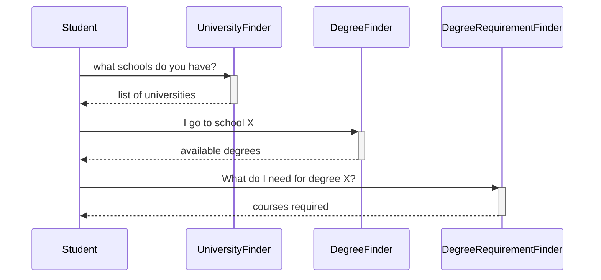

# March 27, 2024
Today we made some user stories for our plan of study maker.

# March 25, 2024
Today we discussed and demo'ed Docker. It was arguably the best discussion of Docker ever had.

We also talked about what our system is going to look like. We broke it up into different parts so that we can 
get started developing pieces on Wednesday.

Again, this is more APIs than we would need, but I'm doing it because (a) it makes it easy to split up and assign to
students, and (b) it gives us a chance to learn new things.

There are some more REST APIs we can create, but let's see how many people are interested in implementing
them first. Interest in implementing in the following languages:
* Python (x)
* JavaScript (x)
* Java
* Haskell (x)
* Racket (x)
* C#/.NET
* C++ (x)

# March 20, 2024
Today we discussed the overly-complicated design of our system. We also discussed containers (i.e. Docker).

We introduced us to Docker, which we'll use to deploy our server at the end.

OK, so what about the design? Here are a few pieces we might want to make:
* a database to store course and curriculum information
* a front end which sends requests (in JSON) to an endpoint and displays the replies (replies also in JSON)
  * for instance, you'll put in the URL or code for the curriculum you want to map, and then
    it will send the request to a REST API and populate the next menu with the received values
* REST APIs - lots of them!
  * programs, curriculums, courses, etc.
* Also important is what is _not_ included: any personal information of any kind

We mentioned that one benefit of having all the "unnecessary" APIs is that we can develop a lot of them concurrently, and in
whatever language we wish. So what languages do we want to use for the back ends?
* Python
* .NET/C#
* Java
* JavaScript
* Haskell
* C++
* Racket (or technically Scheme if needed - same thing)

OK, so let's get back to our Docker discussion. Check out https://hub.docker.com -- lots of pre-made containers that we can provision
and deploy our application on.

# March 18, 2024
Today we started the process of building the CS plan of study tool (perhaps naming it CompSci Compass, Course Correction).

We have a set of requirements, basically wanting to build a plan of study when given a set of constraints (major, courses taken, class preferences, specialty area, graduation date, etc.)

Our first topic of discussion was what technologies to use to build this. Our brainstorm session came up with ideas like:
* we can use a directed acyclic graph data structure
* we could use a web application for the project. This wouldn't make things much harder but would make it much more accessible
* if using Python, we could use a web framework like Django (big) or Flask (small)
* we could use PHP, popular for webpages (yes, still)
* React Native for cross-platform, already have done some of this
* JavaScript (even for the backend)
* HTML, CSS, and JavaScript as a static webpage, might not even need to use a backend
* we could use a database to store _something_, but I struggle to think of what we would _want_ to store and what would be _safe_ to store
  * eg we have to consider things like FERPA
* argument for no backend: basically an online calculator mapping inputs to outputs
* argument for a small backend: we could get experience making REST APIs if we wanted to ...
* we could scrape information from MyUNIverse, although I think this would make me lean towards a desktop app
  * maybe an add-on tool?
* Other languages: .NET (C#), Go, Java, C++ with WASM ... we can check out TIOBE Index

There are several factors to consider when selecting a technologies:
* desktop, mobile, web application?
* programming language: are we wanting to learn something new, use something we know, etc.?
* frameworks: something big and "commercial", small and "easier" to use?
* licensing: do we want open-source or no?
* ease of implementation

So what are our goals? Perhaps:
1. Learn something new (either a new language or a new framework)
2. Modular
3. Demonstrate our competence
